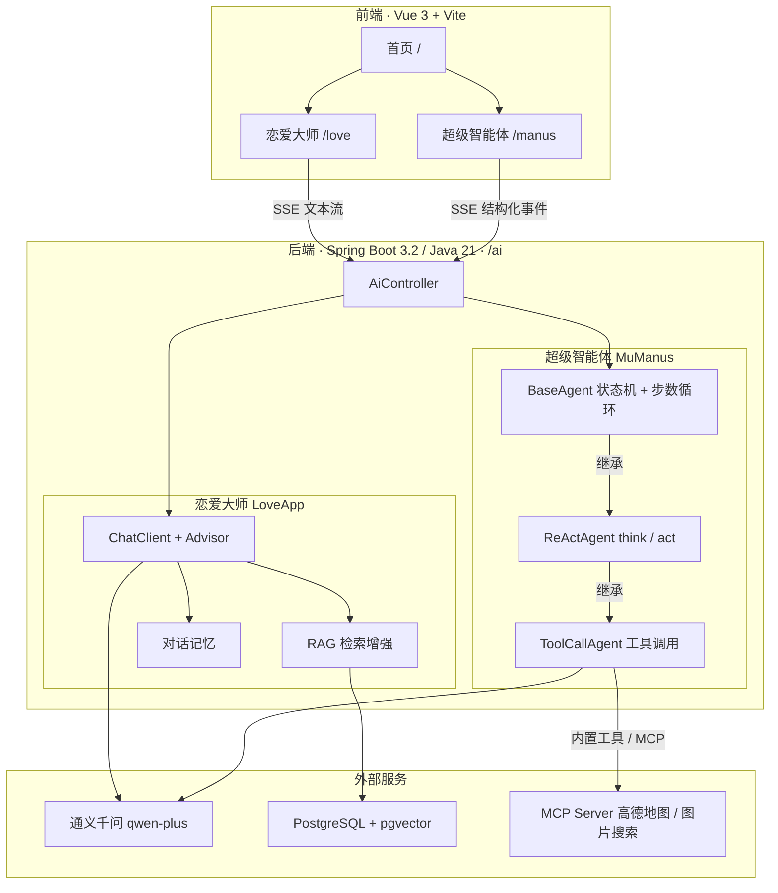

# BAO AI Agent · 宝典 AI 智能体

> 一个基于 **Spring AI + LangChain4j + 通义千问** 的全栈 AI 应用，包含两个开箱即用的场景：
> **AI 恋爱大师**（RAG 情感咨询）与 **AI 超级智能体**（ReAct 工具调用 Agent）。

后端 Spring Boot（Java 21），前端 Vue 3，二者通过 **SSE 流式** 通信，实时展示模型输出与工具调用过程。

---

## 功能特性

| 应用 | 能力 | 亮点 |
| --- | --- | --- |
| 💬 **AI 恋爱大师** | 情感咨询 / 关系沟通 | 多轮对话记忆、Markdown 知识库 RAG 检索增强、查询重写、结构化输出 |
| 🤖 **AI 超级智能体** | 复杂任务自动拆解执行 | ReAct 循环、内置工具集、MCP 工具扩展、逐步流式反馈 |

- **流式对话**：SSE 逐字输出，前端单气泡连续渲染。
- **过程可见**：智能体每一步「调用哪个工具、返回了什么」都以结构化事件下发。
- **工具生态**：联网搜索、网页抓取、文件读写、资源下载、命令执行、PDF 生成，并可接入 MCP Server。

---

## 架构图



> 智能体执行链路：`MuManus → ToolCallAgent → ReActAgent → BaseAgent`。
> 每次循环先 `think()` 决定是否调用工具，再 `act()` 执行，直到产出答案或达到最大步数。

---

## SSE 事件协议

Manus 路径下发的每一行 `data` 都是**单行 JSON 事件**（Love 路径仍为纯文本流），前端按 `type` 分派渲染：

| `type` | 含义 |
| --- | --- |
| `tool_call` | 决定调用某工具（含参数） |
| `tool_result` | 工具执行结果 |
| `answer` | 最终回答 |
| `notice` | 提示信息（如达到最大步数） |
| `error` | 执行出错 |
| `done` | 流结束 |

字段：`type · step · tool · label · text · detail · truncated`（`detail` 超长会截断并标记 `truncated`）。

---

## 技术栈

- **后端**：Java 21 · Spring Boot 3.2.2 · Spring AI 1.0.0-M6 · spring-ai-alibaba-starter · LangChain4j
- **模型**：阿里云百炼 **通义千问 qwen-plus**（对话 + Embedding）
- **存储**：内存向量库 / PostgreSQL + **pgvector** · 对话记忆（内存 / Kryo 文件持久化）
- **协议**：SSE 流式 · MCP（Model Context Protocol）
- **前端**：Vue 3 · Vite · vue-router · axios · EventSource
- **部署**：Docker · Nginx

---

## 目录结构

```
bao-ai-agent/
├── src/main/java/com/swl/baoaiagent/
│   ├── agent/         # 智能体核心：BaseAgent → ReActAgent → ToolCallAgent → MuManus
│   ├── app/           # LoveApp 恋爱大师应用
│   ├── rag/           # RAG：文档加载 / 切分 / 向量库 / 查询重写 / 增强器
│   ├── tools/         # 内置工具集与注册（ToolRegistration）
│   ├── advisor/       # 自定义 Advisor（日志 / Re-Reading）
│   ├── chatmemory/    # 对话记忆实现（内存 / Kryo 文件）
│   ├── controller/    # AiController（HTTP / SSE 入口）
│   ├── config/        # 跨域等配置
│   └── demo/          # 多种调用示例（HTTP / SDK / LangChain4j / Spring AI）
├── src/main/resources/
│   ├── document/      # 恋爱知识库 Markdown 文档
│   ├── mcp-servers.json
│   └── application*.yml
├── bao-ai-agent-frontend/        # Vue 3 前端
└── bao-image-search-mcp-server/  # 图片搜索 MCP Server（独立项目）
```

---

## 快速开始

### 1. 后端

```bash
# 配置密钥：编辑 src/main/resources/application-local.yml
#   填入 DashScope 模型 Key、数据库连接、搜索 API Key
./mvnw spring-boot:run
```

服务默认运行在 `http://localhost:8123/api`，接口文档见 Knife4j `/api/doc.html`。

### 2. 前端

```bash
cd bao-ai-agent-frontend
npm install
npm run dev        # 打开 http://localhost:5173
```

开发环境下 Vite 已将 `/api` 反向代理到 `http://localhost:8123`。

---

## 接口一览

| 方法 | 路径 | 说明 |
| --- | --- | --- |
| `GET` | `/ai/love_app/chat/sync` | 恋爱大师 · 同步返回 |
| `GET` | `/ai/love_app/chat/sse` | 恋爱大师 · SSE 文本流 |
| `GET` | `/ai/love_app/chat/sse_emitter` | 恋爱大师 · SSE（SseEmitter） |
| `GET` | `/ai/manus/chat` | 超级智能体 · SSE 结构化事件流 |

> 完整路径需加前缀 `/api`，参数：`message` / `chatId`（恋爱大师）、`userPrompt`（智能体）。

---

## 部署

- **后端**：`Dockerfile` 多阶段构建（Maven 打包 + 预装 Node 以支持 MCP `npx`），以 `prod` 配置启动。
- **前端**：`npm run build` 产出静态资源，交由 Nginx 托管，并将 `/api` 反向代理到后端。
- **环境变量**：前端通过 `VITE_API_BASE_URL` 指定接口地址（生产为相对路径 `/api`）。

---

## 说明

- 请勿将真实的模型 / 数据库密钥提交到仓库，建议使用环境变量注入。
- 这是一套用于学习实践的 AI Agent 全栈示例，涵盖 RAG、ReAct、工具调用、MCP 与流式交互等核心能力。
